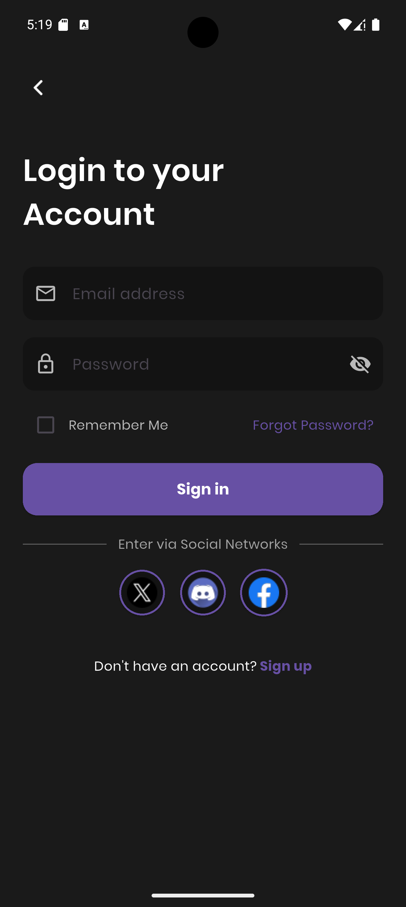
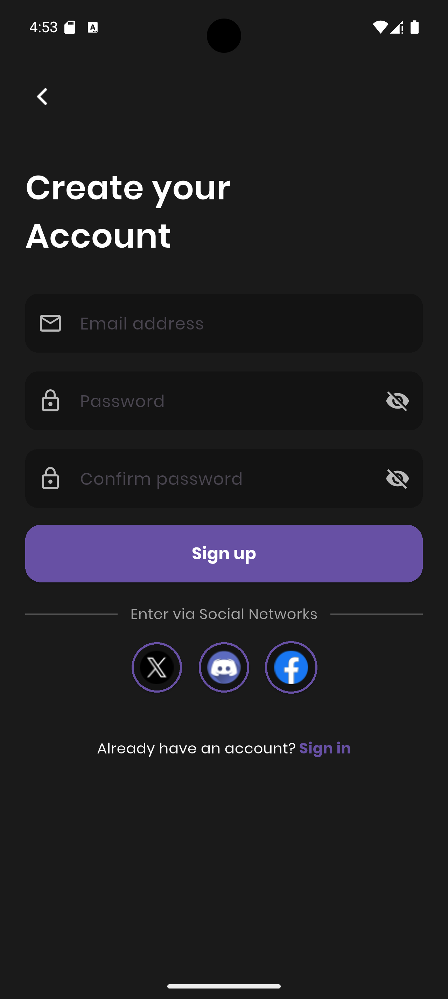

# 🛒 Simple Homepage of Flutter

This project is a simple homepage developed after just one day of learning Flutter. It features Sign Up and Sign In pages and incorporates some basic functionalities.

---

## 📱 Features

- 🔐 **User Authentication**
  - Sign up / Login with email and password
  - Validation for password and email
---

## 🛠️ Tech Stack

- **Dart** (Android)
- **Material Design Components**

---

## 🖼️ Screenshots

| Sign In | Sign Up |
|-------|---------|
|  |  |

---

## 📌 Note

This program marks my first attempt at UX/UI development with Flutter. There's still plenty to refine, but it's a start!

